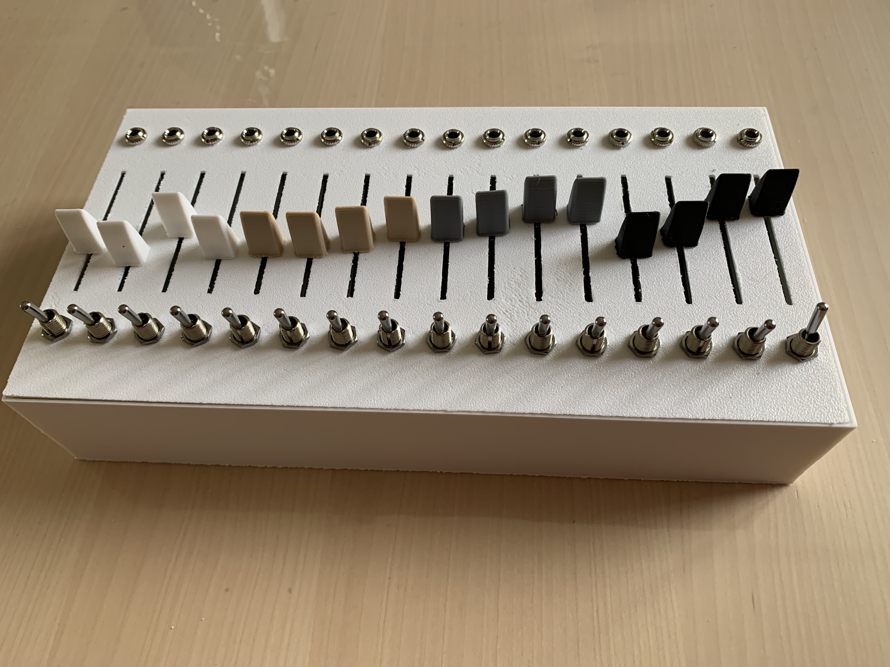
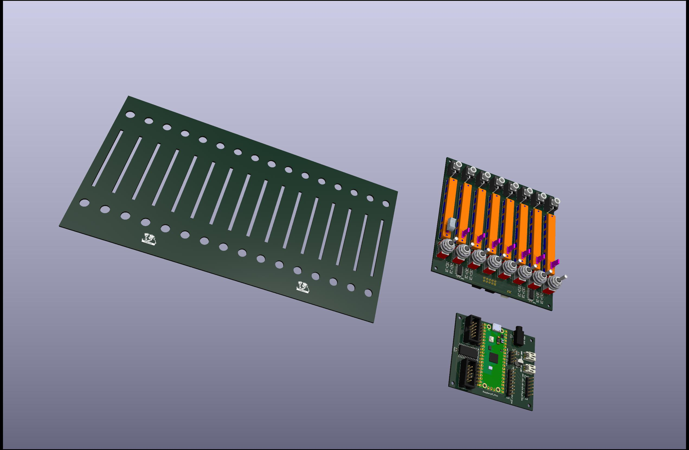

# 8+8nx Faderbank

A modular faderbank based on the [16nx](https://github.com/16n-faderbank/16n) project, designed for Eurorack synthesizers and DAW MIDI control. Sends MIDI data and CV signals.

---


## What is it?

The 8+8nx is a DIY faderbank that splits the original 16nx design into two separate PCBs, making it more flexible and easier to build in different configurations.

It is designed for musicians who want hands-on control over their Eurorack setup or DAW, with a compact and modular form factor.

---

## Differences from the 16nx

| Feature | 16nx | 8+8nx |
|---|---|---|
| PCB | Single board | 2 PCBs (ControlBoard + MainBoard) |
| Faders | 16 | 8 per ControlBoard (expandable to 16) |
| MCU | RP2040 chip | Raspberry Pi Pico |
| Mute switches | No | Yes, per fader |
| I2C port | Yes | Removed |
| GPIO exposure | Partial | All free Pico pins exposed |

---



## Hardware

- **MainBoard** — hosts the Raspberry Pi Pico, handles USB MIDI, CV outputs and all connections
- **ControlBoard** — hosts 8 faders and mute switches, connects to the MainBoard

You can run a single ControlBoard (8 faders) or chain two for a full 16-fader setup.

---

## Features

- USB MIDI output
- CV output
- 8 or 16 fader configuration
- Mute switch per fader
- All free GPIO pins of the Raspberry Pi Pico exposed for customization
- Compatible with Eurorack synthesizers and DAWs

---

## Firmware

Based on the 16nx firmware, adapted for the Raspberry Pi Pico.

### Build requirements

- [Raspberry Pi Pico SDK](https://github.com/raspberrypi/pico-sdk)
- CMake 3.13+
- ARM GCC toolchain

### Build

```bash
git clone https://github.com/jojo-monk/8-8nx.git
cd 8-8nx/firmware
mkdir build && cd build
cmake ..
make
```

Flash the resulting `.uf2` file onto your Pico by holding BOOTSEL while plugging it in, then drag and drop the file.

---

## Project status

✅ Tested and working

---

## Credits

Based on the [16nx faderbank](https://github.com/16n-faderbank/16n) project.

---

## License

Hardware and firmware released under the same license as the original 16nx project.